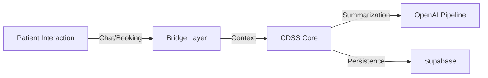

# 🏥 Ayurvaidya

### AI-assisted Clinical Decision Support for Affordable Healthcare in Bharat

> **Built for OpenAI Academy × NxtWave Buildathon**

**Ayurvaidya is NOT an AI doctor.**  
It is a simplified **Clinical Decision Support System (CDSS)** that bridges the gap between traditional wisdom (Ayurveda) and modern medical safety. We use AI to structure patient data and provide "Guidance, Not Diagnosis," enabling affordable, scalable, and responsible healthcare for India's next billion users.

---

## 🇮🇳 The Problem: Healthcare fails *before* the hospital

In Bharat (rural and semi-urban India), the biggest healthcare challenge isn't just the lack of doctors—it's the **chaos of the first mile**:

1.  **Confusion**: Patients don't know if they need a specialist, a GP, or home remedies.
2.  **Overcrowding**: Doctors waste valuable time collecting basic history that could be automated.
3.  **Unsafe Self-Medication**: Without accessible advice, patients turn to unverified WhatsApp forwards or quacks.
4.  **Disconnect**: Ayurveda and Allopathy operate in silos, missing opportunities for holistic care.

Existing booking apps just connect A to B. We need a system that **understands** the patient before they even enter the clinic.

---

## 💡 The Core Idea: Assistive, Not Authoritative.

Ayurvaidya functions as a **Clinical Bridge**. It activates intelligent workflows from simple, marketing-style interactions (like a chat widget or booking form).

Instead of replacing the doctor, our system prepares a structured **Case File** that gives the doctor a "head start."

**Why this approach?**
*   **Safety**: AI never makes the final call. It summarizes and suggests.
*   **Trust**: Patients feel heard immediately; doctors get better data.
*   **Scale**: One backend can serve multiple frontend interfaces (Web, WhatsApp, Kiosks).

---

## 🏗️ System Architecture

Our architecture is designed for **resilience and responsibility**.

### 1. The Frontend (Entry Point)
*   A lightweight, accessible HTML/JS interface.
*   Designed to look like a friendly directory or chat service to reduce patient anxiety.
*   **Key Innovation**: The frontend is "dumb"—it effectively creates marketing leads that the backend converts into clinical cases.

### 2. The Bridge Layer (Activation)
*   **Role**: The intake valve. It accepts disparate inputs (chat messages, form fills) and standardizes them into a `CaseFile`.
*   **Importance**: This decoupling allows us to swap frontends without breaking clinical logic.

### 3. CDSS Core (Safety + Workflow)
*   **The Brain**: Manages the state of a case (Open -> Review -> Closed).
*   **Safety Engine**: Enforces strict rules:
    *   *Rule 1*: No prescriptions by AI.
    *   *Rule 2*: Flag emergency keywords immediately.
    *   *Rule 3*: Always defer to human judgment.

### 4. AI Pipeline (OpenAI Powered)
*   **Model**: OpenAI Chat Completions API (model configurable, optimized for safety and latency).
*   **Task**: Clinical Summarization. It turns "my tummy hurts and I ate spicy food" into "Patient reports abdominal discomfort following pitta-aggravating dietary intake."
*   **Resilience**: If the OpenAI quota is exceeded (Error 429), the system automatically degrades to a **Safe Stub Mode**, ensuring no downtime.

### 5. Persistence (Supabase)
*   **Role**: The source of truth.
*   **Data**: Stores Patients, Cases, and Audit Logs.
*   **Security**: Ensures patient data is durable and queryable.

---

## 🛡️ AI Responsibility & Safety

We take the "responsible" part of Responsible AI seriously.

> **⚠️ CORE PRINCIPLE: GUIDANCE, NOT DIAGNOSIS**

*   **Human-in-the-loop**: Every AI output is meant for **doctor review**, not direct patient consumption in critical scenarios.
*   **Safe Failover**: We simulated API failures (Quota Limits) to prove our system doesn't crash—it just becomes less "smart" but remains functional.
*   **Transparency**: Users are told when they are speaking to an AI.
*   **Guardrails**: The prompt engineering explicitly forbids the model from simulating a licensed medical professional's final diagnosis.

---

## 🤝 OpenAI & Supabase: A Perfect Match

| Technology | Usage in Ayurvaidya |
| :--- | :--- |
| **OpenAI** | **Clinical Summarization**. We use LLMs for what they are best at: text processing and structure, not medical invention. This focus reduces hallucinations. |
| **Supabase** | **Audit Trail**. Every case file and AI interaction is saved. In healthcare, "if it isn't written down, it didn't happen." Supabase provides that guarantee. |

---

## ✅ Features (Demo Ready)

### Implemented & Live
*   **Real-time Chat with Backend**: The frontend widget talks directly to our Express API.
*   **Dynamic Doctor Data**: Profiles are fetched from the system, not hardcoded.
*   **Smart Booking**: Booking an appointment automatically opens a clinical `CaseFile`.
*   **Resilient AI**: System handles OpenAI 429 errors gracefully (verified in testing).
*   **Demo Authentication**: A seamless "Guest Login" flow for hackathon judges.

### Planned / Roadmap
*   **Doctor Dashboard**: A specialized UI for doctors to review the AI summaries.
*   **Vernacular Voice Support**: Using OpenAI Whisper for Hindi/Voice inputs.
*   **Ayurvedic Constitution Analysis**: Deeper analysis of *Prakriti* (Body Type). Currently designed as a parallel-care framework, with full reasoning intelligence planned for future iterations.

---

## 🕹️ Demo Walkthrough

Follow these steps to experience the full CDSS flow:

1.  **Launch**: Open `http://localhost:3000`.
2.  **Login**: Click **Login** and sign in as a Guest (e.g., `judge@demo.com`).
3.  **Engage**:
    *   *Option A*: Chat with the assistant. Ask about "stress" or "digestion".
    *   *Option B*: Go to **Find Doctors**, select **Dr. Ananya**, and **Book** an appointment.
4.  **Observe**:
    *   The system confirms your action.
    *   Behind the scenes, a case is created in Supabase.
    *   The AI (or Stub) processes your input for the doctor.
    *   *Note: If specific AI model quotas are exceeded, the system automatically triggers "Safe Stub Mode" to ensure the demo never fails.*

---

## 🛠️ Tech Stack

*   **Frontend**: HTML5, CSS3, Vanilla JS (Lightweight & Fast)
*   **Backend**: Node.js, Express.js
*   **AI**: OpenAI API (gpt-3.5-turbo)
*   **Database**: Supabase (PostgreSQL)
*   **Tools**: Postman, VS Code, Git

---

## 🏆 Why This Wins

This is not just a "wrapper" around ChatGPT.

1.  **System Thinking**: We built a tiered architecture (Bridge -> Core -> AI), not just a chatbot.
2.  **Bharat First**: We focused on accessibility and blending Ayurveda, a key part of Indian culture, with modern science.
3.  **Real Constraints**: We handled API limits, safety failures, and data persistence from Day 1.
4.  **Responsible**: We solved for *safety* before we solved for *intelligence*.

---

## 👥 Team

*   **Nishchal Kapadia**
*   **Bhavya Jain**
*   **Pragyan Dudi**

---

### *Truth in Engineering*
*We believe that AI in healthcare shouldn't be magic—it should be reliable engineering. This project is a step towards that reality.*
